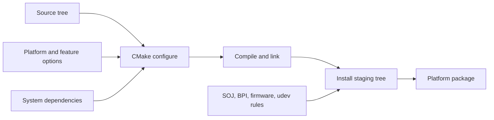

# Build and release architecture

openFPGALoader is built as a configured native executable. CMake selects the
feature set, discovers platform libraries, compiles the corresponding source
files, and installs both the binary and runtime transport data.

## Configure, build, install



The canonical local flow is:

```bash
cmake -S . -B build -DCMAKE_BUILD_TYPE=Release
cmake --build build --parallel
cmake --install build --prefix "$PWD/pkg/usr/local"
```

For a feature-complete Linux build, the workflow installs libftdi, libusb,
hidapi, libudev, pkg-config, zlib, and development tools. macOS disables
Linux-only integrations. Windows MSYS2 and Windows cross builds use platform
toolchains and portable runtime packaging.

## Important CMake options

| Option family | Examples | Effect |
| --- | --- | --- |
| Optimization and linkage | `ENABLE_OPTIM`, `BUILD_STATIC` | Changes compile flags and static/dynamic linkage. |
| Dependency discovery | `USE_PKGCONFIG`, `LINK_CMAKE_THREADS` | Selects how libraries and threads are found. |
| Platform integrations | `ENABLE_UDEV`, `ENABLE_LIBGPIOD`, `ENABLE_USB_SCAN` | Enables Linux device management, GPIO, and USB scanning. |
| Cable support | `USE_LIBFTDI`, `ENABLE_CMSISDAP_V1`, `ENABLE_DFU`, `ENABLE_XVC_SERVER`, `ENABLE_REMOTE_BITBANG` | Includes cable adapters and their dependencies. |
| Vendor support | `ENABLE_XILINX_SUPPORT`, `ENABLE_LATTICE_SUPPORT`, `ENABLE_GOWIN_SUPPORT`, and others | Includes vendor/device implementations. |
| Cross compilation | `WINDOWS_CROSSCOMPILE`, `CROSS_COMPILE_DEPS`, `WINDOWS_STATIC_ZLIB` | Selects the MinGW toolchain and dependency strategy. |
| Runtime data | `OPENFPGALOADER_PORTABLE_WINDOWS_DATADIR` | Stores Windows data paths relative to the executable for portable archives. |

When a feature is disabled, validate that the CLI does not advertise a
nonfunctional board/cable and that the build does not retain a link dependency
that the option was supposed to remove.

## Installed runtime layout

The install rules place the executable under `bin/` and data under the
configured data root. The data includes compressed SPI-over-JTAG and
BPI-over-JTAG bitstreams, Spartan-6 `.cor` data, and—when packaging scripts
request it—XPCU firmware and udev rules.

Portable Windows packages use a layout equivalent to:

```text
bin/openFPGALoader.exe
share/openFPGALoader/          # transport data
share/licenses/openFPGALoader/LICENSE
```

The Windows cross-build uses a relative data directory so a build path inside
Docker is not embedded as an unusable runtime path. See the
[Docker cross-Windows guide](../DOCKER_CROSS_WINDOWS.md).

## CI validation layers

The workflows intentionally test different contracts:

| Workflow job | Validates |
| --- | --- |
| MkDocs job | Generated compatibility tables, strict documentation build, published site artifact. |
| Linux/macOS build | Native compilation and package staging. |
| Windows MSYS2 matrix | Windows-native toolchain variants and executable smoke tests. |
| Windows cross build | MinGW packaging, PE/DLL checks, portable data layout, and ZIP artifact. |
| Source regression | Deterministic parser/writer behavior without hardware. |
| Package tests | Installed executable can show help/list devices and attempt detection. |

The tests do not replace hardware validation. Probe firmware, FPGA chain
topology, flash signal integrity, and timing-sensitive SOJ behavior require
physical fixtures or captured traces.

## Release risks to watch

- The project version has historically appeared in more than one place. Check
  the CMake project version, package naming, tags, and release notes together
  before cutting a release.
- A source file can compile in a full Linux build but be absent from a smaller
  platform feature set. Test the intended matrix, not only the developer's
  default configuration.
- An archive can contain a working executable but omit the SOJ/BPI data or a
  required DLL. Inspect archive contents and run the executable from the
  extracted tree.
- The Windows cross-build must run with Docker's Linux container engine because
  its build image is Alpine Linux with a MinGW toolchain.
