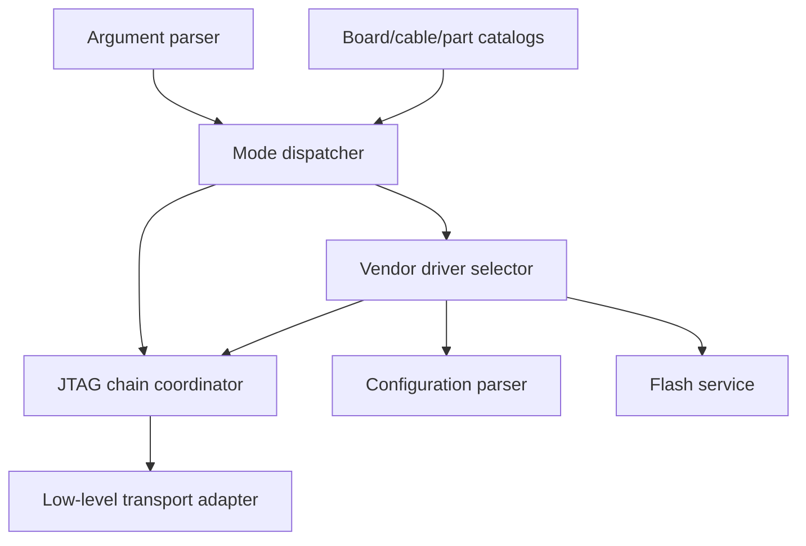
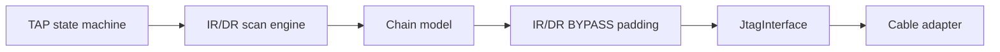
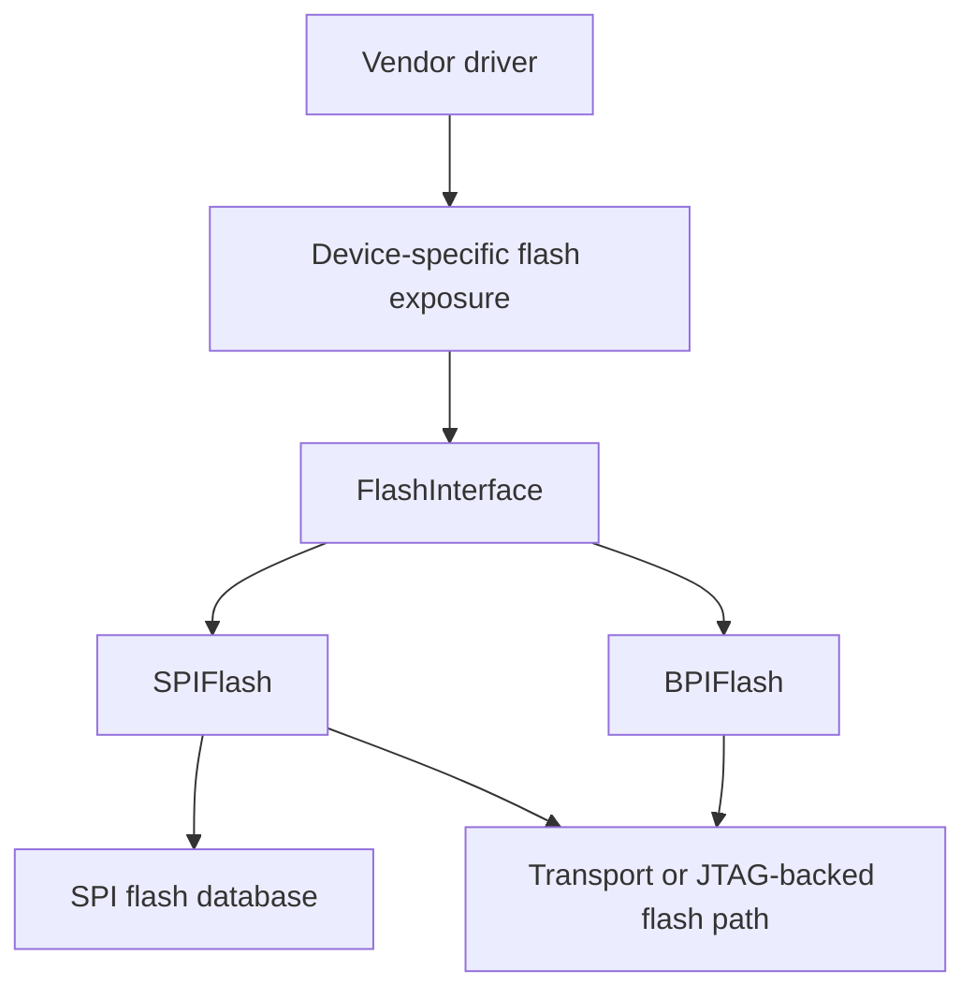

# C4: components

This is the C4 Level 3 view of the most important runtime container: the CLI
and protocol composition. It focuses on the components a maintainer changes
when adding support or diagnosing a chain/flash failure.

## CLI and programming components

| Component | Contract | Failure it should make diagnosable |
| --- | --- | --- |
| Argument parser | CLI options become `arguments` plus pin configuration | Invalid combinations, missing files, unsupported mode |
| Mode dispatcher | Chooses list, JTAG, SPI, DFU, or XVC flow | Wrong path selected for board/flags |
| Catalog resolver | Names become cable/part/default metadata | Unknown board, cable, or part |
| JTAG chain coordinator | Detect, select, shift IR/DR, maintain TAP state | Unstable IDCODE, wrong target index, scan alignment |
| Low-level transport adapter | `JtagInterface` or `FlashInterface` | USB/probe errors, buffering, clock/edge mismatch |
| Vendor driver selector | IDCODE maps to `Device` implementation | Unsupported or incorrectly classified device |
| Configuration parser | File becomes normalized configuration bytes | Format/header/size/order errors |
| Flash service | Generic memory lifecycle | JEDEC/protection/erase/write/verify errors |

## JTAG component detail

`Jtag` tracks the logical TAP state, device IDCODEs, instruction-register
lengths, selected target, and bypass bits before delegating physical clocks to
`JtagInterface`. This distinction matters when a passive or trailing device
contributes physical scan bits but should not become the selected programming
target.

## Flash component detail

The interface separates “how this vendor exposes flash” from “how a known
flash is erased and programmed.” Keep model metadata in the flash database;
keep vendor unlock/instruction sequences in the vendor path.

## SOJ/XPCU component boundary

SPI-over-JTAG is a transport asset plus a JTAG-backed execution path. The
SOJ bitstream is built and installed as data; the JTAG engine and adapter still
own scan framing, buffering, and edge behavior. XPCU-specific artifacts and
quirks are represented by narrow adapter hooks. Start with the
[SOJ review](../../SOJ_REVIEW.md) when a failure involves trailing scan bits,
read alignment, or unexpected bypass devices.
