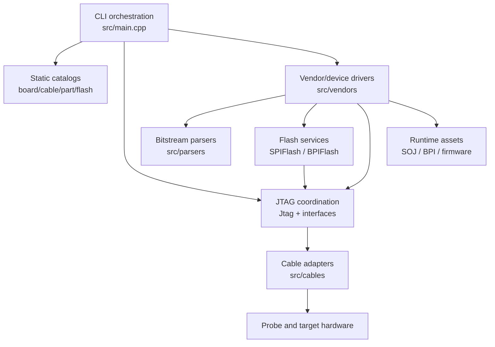

# C4: containers

This is the C4 Level 2 view. A “container” here means a separately meaningful
runtime or source subsystem, not necessarily a process or deployable service.

## Container responsibilities

| Container | Main implementation | Inputs | Outputs |
| --- | --- | --- | --- |
| CLI orchestration | `src/main.cpp` | Arguments, environment, catalog defaults | Selected mode and operation result |
| Static catalogs | `src/utils/*.hpp`, `spiFlashdb.hpp` | Compiled support definitions | Board/cable/part/flash metadata |
| JTAG coordination | `src/protocols/jtag.*` | Target selection and scan requests | TAP transitions, chain data, scan results |
| Cable adapters | `src/cables/` | JTAG/SPI/DFU/XVC operations | Electrical or remote transport I/O |
| Vendor/device drivers | `src/vendors/`, `src/utils/device.*` | Parsed data, selected target, protocol services | Vendor-specific configuration and status |
| Bitstream parsers | `src/parsers/` | User file and format selection | Normalized bit data and metadata |
| Flash services | `src/protocols/spiFlash.*`, `bpiFlash.*` | Flash model and payload | Erase/read/write/verify operations |
| Runtime assets | `src/transport_db/`, installed data | Build/package selection | Bridge bitstreams and firmware at runtime |

## Dependency rules

- CLI may compose every container, but lower layers must not call back into
  argument parsing or display code.
- Catalogs describe capabilities; they should not perform I/O.
- Protocol engines operate through interfaces; cable implementations own
  device-library calls and platform handles.
- Parsers transform files; they should not select cables or perform scans.
- Generic flash services own generic memory operations; vendor drivers own the
  instruction sequence that exposes a device's flash.
- Assets are read through the data-path abstraction or explicit override, not
  through a build-directory assumption.
