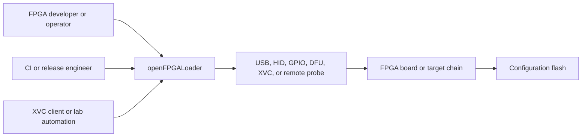

# C4: system context

This is the C4 Level 1 view. It shows who uses openFPGALoader and which
external systems it controls; implementation details belong in the container
and component views.

## Actors and external systems

| Element | Type | Responsibility |
| --- | --- | --- |
| FPGA developer/operator | Person | Chooses board/cable, supplies a bitstream, and interprets diagnostics. |
| CI/release engineer | Person/system actor | Builds, packages, smoke-tests, and publishes platform artifacts. |
| XVC client or lab automation | External system | Sends remote JTAG requests when the XVC server mode is enabled. |
| openFPGALoader | Software system | Discovers hardware, parses configuration data, and performs JTAG/SPI/DFU operations. |
| Probe/cable | External hardware/system | Converts host operations into electrical JTAG, SPI, DFU, GPIO, or remote traffic. |
| FPGA board/target chain | External hardware | Contains FPGA/CPLD devices, optional bridge devices, and a configuration path. |
| Configuration flash | External hardware | Stores persistent FPGA configuration when flash programming is requested. |

## System boundary

Inside the system boundary are the CLI, protocol engines, cable adapters,
vendor drivers, parsers, static catalogs, and installed transport assets. The
operating system libraries and physical probe are outside the application
boundary even though CMake and the adapters depend on them.

## Principal scenarios

### Program SRAM over JTAG

The operator selects a board or cable, the tool detects the chain, maps the
IDCODE to a vendor driver, parses the bitstream, and sends device-specific
JTAG scans to volatile FPGA configuration memory.

### Program persistent flash

The same discovery and vendor selection precede a flash algorithm that handles
identification, protection, erase, write, and verify. The target may be an
internal or external flash path depending on the device.

### Use a non-JTAG path

Board metadata can select direct SPI or DFU. Those flows share CLI intent and
file parsing but use a different transport contract and do not require a JTAG
chain scan.

### Run remotely

An XVC client/server arrangement transports JTAG requests over a network while
the normal JTAG engine remains responsible for TAP and scan semantics.
