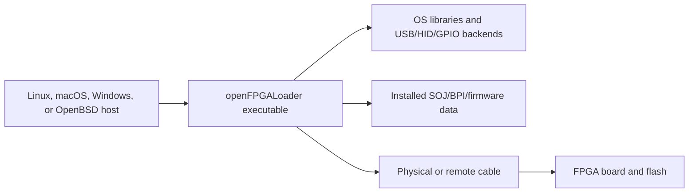
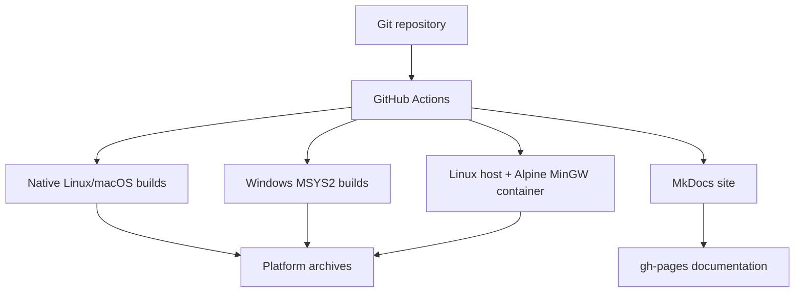

# C4: deployment

This view separates the machine that runs the binary from the machines that
build and publish it.

## Operator deployment

The executable, its dynamic libraries, runtime data, permissions/udev rules,
and the physical probe together form the usable deployment. Copying only the
binary is not a complete installation when the selected path needs transport
assets or shared libraries.

## Build and release deployment

## Platform matrix

| Target | Build environment | Packaging concern | Expected validation |
| --- | --- | --- | --- |
| Linux | Ubuntu runner or native toolchain | Shared libraries, udev rules, data root | `--version`, `--help`, `--list-*`, extracted package test |
| macOS | Homebrew dependencies on `macos-14` | No Linux udev/libgpiod integration | Same CLI smoke tests and extracted archive |
| Windows MSYS2 | UCRT64/MINGW64 toolchains | DLL collection and Windows path semantics | `.exe` smoke tests and ZIP contents |
| Windows cross | Linux runner, Alpine Docker image, MinGW | Linux container engine, portable data directory, PE/DLL checks | Cross-build script and extracted ZIP |
| Documentation | Python + MkDocs Material | Generated compatibility tables and strict links | `mkdocs build --strict` |

## Deployment boundary checklist

Before declaring a release artifact usable, verify:

- The executable starts on the target platform.
- `--list-boards` and `--list-cables` match the configured feature set.
- Transport data exists in the path compiled/configured for that package.
- Required shared libraries or DLLs are present and discoverable.
- Linux packages contain the required udev rules where the workflow promises
  them.
- Documentation describes the artifact's actual platform and limitations.
