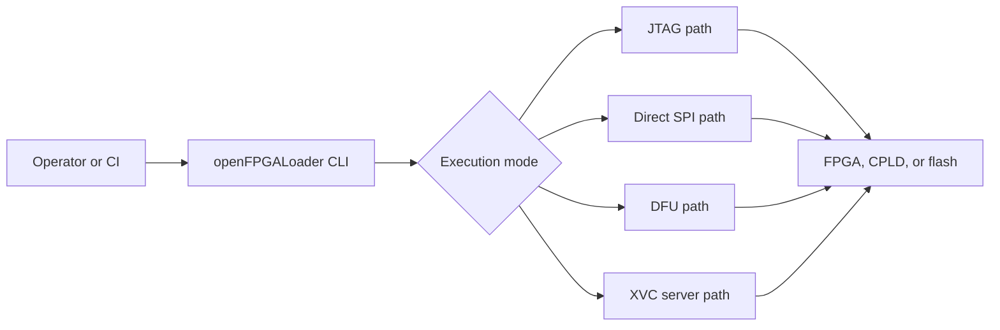
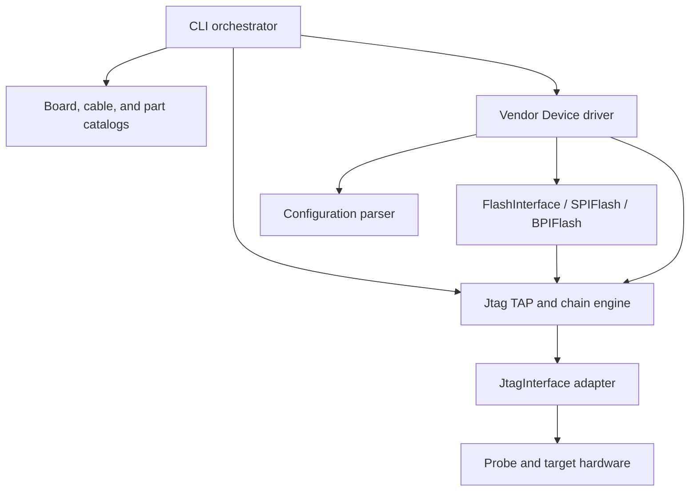

# Architecture overview

This is a source-verified architecture guide for openFPGALoader. It describes
the repository as it is implemented today: a native C++ command-line program
with compile-time feature selection, static hardware catalogs, protocol
engines, vendor drivers, and cable-specific adapters.

The guide is intentionally separate from the user guide. The user guide tells
an operator which command to run; this section tells a maintainer where that
command is implemented, which boundary owns the behavior, and what must be
validated when it changes.

## System at a glance

`src/main.cpp` owns the first dispatch decision. The selected path then uses
an abstract protocol boundary rather than making every vendor implementation
understand every cable:

| Responsibility | Source of truth | Architectural role |
| --- | --- | --- |
| CLI options and mode dispatch | [`src/main.cpp`](https://github.com/xsession/openFPGALoader/blob/master/src/main.cpp) | Turns user intent into a board, cable, target, and operation. |
| Board and cable resolution | [`src/utils/board.hpp`](https://github.com/xsession/openFPGALoader/blob/master/src/utils/board.hpp), [`src/utils/cable.hpp`](https://github.com/xsession/openFPGALoader/blob/master/src/utils/cable.hpp) | Static catalogs that provide defaults and capabilities. |
| JTAG TAP and chain handling | [`src/protocols/jtag.hpp`](https://github.com/xsession/openFPGALoader/blob/master/src/protocols/jtag.hpp), [`src/protocols/jtagInterface.hpp`](https://github.com/xsession/openFPGALoader/blob/master/src/protocols/jtagInterface.hpp) | Converts high-level scans into cable-independent JTAG operations. |
| Vendor/device behavior | [`src/vendors/`](https://github.com/xsession/openFPGALoader/tree/master/src/vendors) | Knows vendor instruction sets, configuration sequences, and flash access. |
| Configuration-file parsing | [`src/parsers/`](https://github.com/xsession/openFPGALoader/tree/master/src/parsers) | Converts raw, Intel HEX, MCS, JED, POF, and vendor formats into bit data. |
| Flash algorithms | [`src/protocols/spiFlash.hpp`](https://github.com/xsession/openFPGALoader/blob/master/src/protocols/spiFlash.hpp), [`src/protocols/bpiFlash.hpp`](https://github.com/xsession/openFPGALoader/blob/master/src/protocols/bpiFlash.hpp) | Implements erase, write, read, verify, protection, and quad-mode operations. |
| Cable transport | [`src/cables/`](https://github.com/xsession/openFPGALoader/tree/master/src/cables) | Implements USB, HID, GPIO, DFU, remote, XVC, and vendor probe details. |
| Transport firmware and bridge images | [`src/transport_db/`](https://github.com/xsession/openFPGALoader/tree/master/src/transport_db) | Supplies SPI-over-JTAG and BPI-over-JTAG bitstreams used at runtime. |

## The normal JTAG request

The common programming path is a pipeline with explicit ownership at each
boundary:

1. `main.cpp` parses options and resolves board/cable defaults.
2. `Jtag` constructs the selected `JtagInterface` adapter.
3. `Jtag::detectChain()` reads IDCODEs and IR lengths, then selects a target.
4. The IDCODE is mapped through `fpga_list` to a vendor/device implementation.
5. The vendor driver parses the file and issues device-specific instructions.
6. Flash operations use `FlashInterface` plus `SPIFlash` or `BPIFlash` where the
   target stores configuration persistently.
7. The adapter batches or clocks the low-level transactions and returns status.

This is the key dependency direction:

## Architectural invariants

- A board entry may supply the cable, FPGA part, pins, communication mode,
  default frequency, and flash metadata. Explicit command-line choices must be
  treated as overrides when the option parser defines them.
- Vendor code should operate through `Jtag`, `FlashInterface`, and parser
  contracts. Raw USB or HID details belong in a cable adapter, with narrowly
  documented exceptions for transport-specific behavior.
- CMake feature flags decide which vendors, cables, and modes exist in the
  binary. A class that is present in the source tree is not necessarily
  available in every package.
- Installed SOJ/BPI data is part of the runtime product. The binary's default
  data directory and `OPENFPGALOADER_SOJ_DIR` override must be considered when
  changing, packaging, or relocating these files.
- A successful compile proves syntax and linkage, not electrical correctness.
  Hardware-dependent changes need at least a deterministic regression test,
  a smoke test, and a documented physical validation case where possible.

## Known tradeoffs

The implementation is deliberately pragmatic, but maintainers should know its
costs:

- The orchestration in `main.cpp` is centralized. This makes the CLI behavior
  easy to trace but makes new modes more likely to create a large conditional
  surface.
- Device classes commonly combine `Device` and `FlashInterface` through
  multiple inheritance. It keeps vendor algorithms close to their transport
  contract, but it also couples device selection and flash behavior.
- Boards, cables, FPGA parts, and flash models are static C++ catalogs. Support
  is fast and deterministic at runtime, but catalog edits require a rebuild.
- Cable-specific hooks in `JtagInterface` exist for real hardware quirks such
  as read-edge selection, XPCU scan artifacts, and control-bit modes. These
  hooks should remain narrow; they are not a second general-purpose protocol.
- Tests are primarily build, parser, package, and command-line smoke tests.
  Full coverage across probe firmware, FPGA families, flash models, operating
  systems, and signal integrity is not available in CI.

## Read next

- [Source map](source-map.md): navigate from a behavior to the owning files.
- [Runtime flows](runtime-flows.md): follow JTAG, SPI, DFU, and XVC requests.
- [Build and release](build-and-release.md): understand feature flags and
  packaged runtime assets.
- [Architecture decisions](decisions.md): record the choices and limitations
  that should not be rediscovered during maintenance.
- [C4 context](c4/context.md), [containers](c4/containers.md),
  [components](c4/components.md), and [deployment](c4/deployment.md): use the
  same architecture at four levels of zoom.
