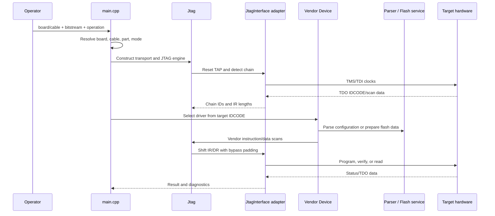
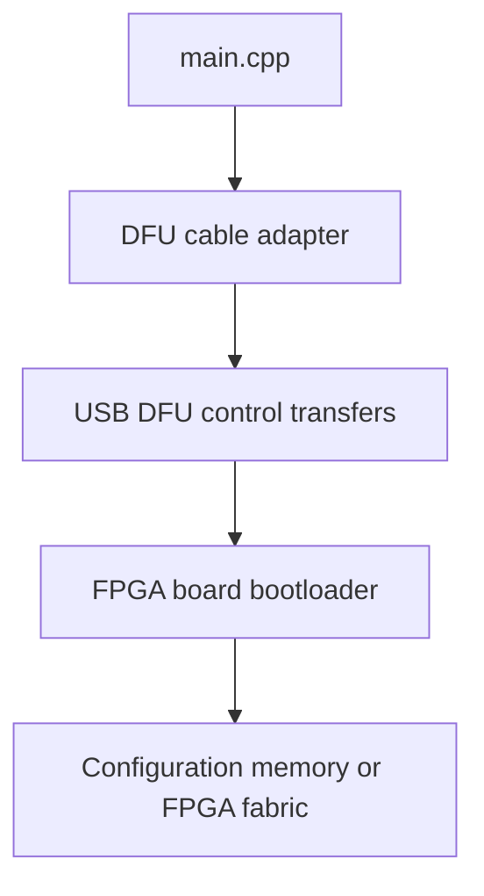

# Runtime flows

These flows describe the behavior that matters when debugging a failed
programming attempt. They are intentionally expressed in terms of the actual
classes and interfaces rather than an idealized service architecture.

## JTAG programming

The important failure boundaries are:

| Boundary | Typical symptom | First place to inspect |
| --- | --- | --- |
| Cable discovery | No cable, permission error, wrong serial | Adapter constructor and platform dependencies in `src/cables/` |
| TAP reset or clocking | IDCODE is zero/unstable, scan never completes | `Jtag::go_test_logic_reset()`, clock frequency, read/write edge |
| Chain interpretation | Correct IDCODE at wrong index, trailing artifact | `Jtag::detectChain()`, `device_select()`, BYPASS bookkeeping |
| Vendor selection | Unsupported device or wrong programming sequence | `part.hpp`, feature flags, vendor dispatch in `main.cpp` |
| File parsing | Wrong size, header error, silent truncation | Matching parser in `src/parsers/` |
| Flash algorithm | Busy timeout, protection, verify mismatch | `SPIFlash`/`BPIFlash`, flash database, vendor-specific path |
| Runtime data | SOJ/BPI/firmware file not found | Install layout, `DATA_DIR`, `OPENFPGALOADER_SOJ_DIR` |

## Direct SPI

Direct SPI is selected by `--spi` or by a board whose communication mode is
`COMM_SPI`. The route bypasses the JTAG chain engine and uses a cable/device
implementation that satisfies `FlashInterface`, commonly FTDI SPI or a
direct Lattice/ICE40 path.

Because no JTAG IDCODE is required, direct SPI failures should be diagnosed
through cable enumeration, chip-select wiring, JEDEC identification, and
flash geometry before investigating FPGA vendor drivers.

## DFU

DFU is selected by `--dfu` or a `COMM_DFU` board entry. The DFU adapter owns
USB control transfers and alternate-setting selection. It is a different
transport contract from `JtagInterface`; do not add DFU-specific state to the
JTAG engine just to share a command-line path.

## XVC

XVC has two forms in the project: an XVC client cable adapter and, when
compiled, an XVC server mode. The server accepts remote scan requests and
routes them through a local cable adapter; the client makes a remote endpoint
look like a `JtagInterface` to the normal JTAG engine.

## Bitstream and flash lifecycle

The parser and flash layers have separate responsibilities:

1. The parser validates the input format and extracts the configuration
   payload.
2. The vendor driver chooses whether the payload targets SRAM, internal flash,
   or an external configuration flash.
3. The flash service discovers or accepts the flash type, applies protection
   policy, erases the required region, writes data, and optionally verifies it.
4. The vendor driver restores the target to the requested reset/run state.

Do not “fix” a parser by changing a flash offset, or fix a vendor instruction
sequence by changing generic flash geometry. Those are different ownership
boundaries and should be debugged separately.
