# Visual guide to openFPGALoader

This page is a diagram-first tour of the project. Read from top to bottom when
you are new to the codebase; jump directly to the relevant diagram when
debugging a board, cable, flash, or workflow problem.

The diagrams are intentionally tied to concrete implementation boundaries. The
names in brackets are the source locations that own the behavior.

## 1. One request, one target path

The whole product can be understood as a command-line request entering one of
four execution paths.

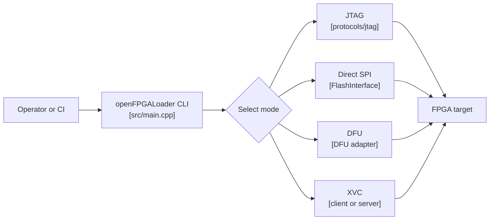

**Teaching point:** board metadata and explicit flags select the path; the
selected path determines whether chain discovery is required.

## 2. How `main.cpp` routes a request

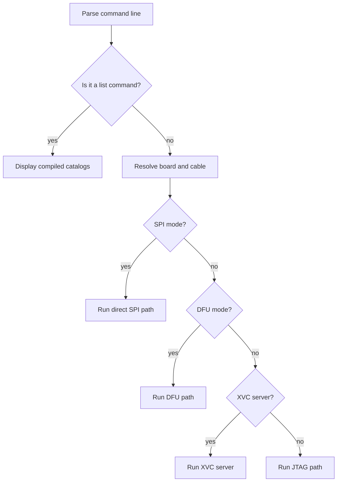

The dispatch order is important: a board can imply SPI or DFU, while the
default path is JTAG. Changes to the mode decision should be reviewed against
the option parser, board catalog, and cable registry together.

## 3. JTAG programming at a glance

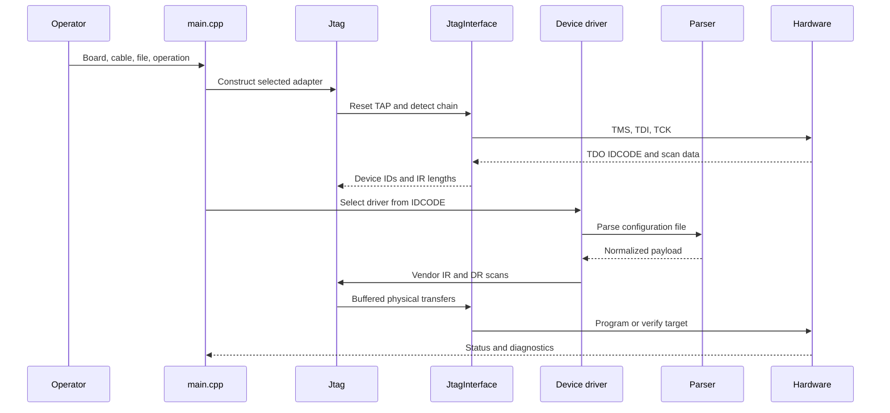

**Teaching point:** the vendor driver owns device semantics, while `Jtag` owns
TAP state, scan framing, and chain padding.

## 4. JTAG discovery and target selection

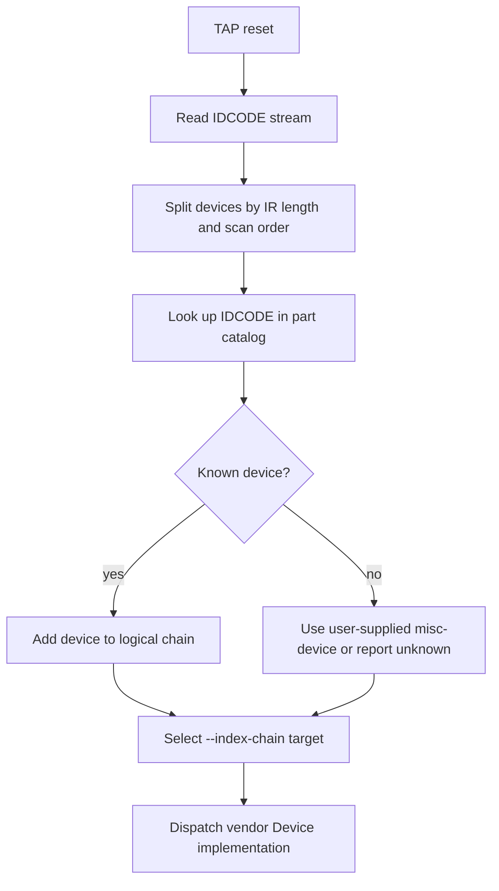

The logical chain is not always identical to the electrical chain. Passive
devices, bridge CPLDs, and trailing scan artifacts may contribute bits without
being programming targets.

## 5. Why BYPASS alignment matters

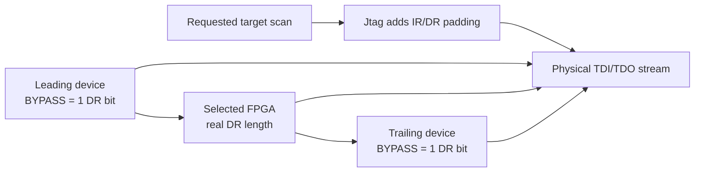

When the selected target is in the middle of a chain, the requested data must
be surrounded by the correct BYPASS bits. A one-bit mistake can look like a
vendor failure, a flash timeout, or a bad read edge even though the root cause
is chain alignment.

Relevant implementation state lives in `Jtag`: device order, IR lengths,
leading/trailing padding, selected index, and trailing scan-artifact tracking.

## 6. Bitstream parsing is separate from programming

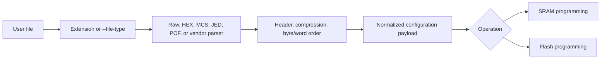

**Boundary rule:** a parser should transform input data and report malformed
input. It should not open a cable, choose a JTAG device, or silently change a
flash offset.

## 7. Flash programming lifecycle

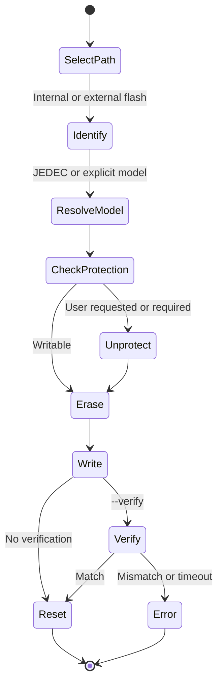

The vendor driver exposes the device-specific flash path. `SPIFlash` or
`BPIFlash` then performs generic memory operations using the flash database and
the `FlashInterface` contract.

## 8. Direct SPI versus SPI-over-JTAG

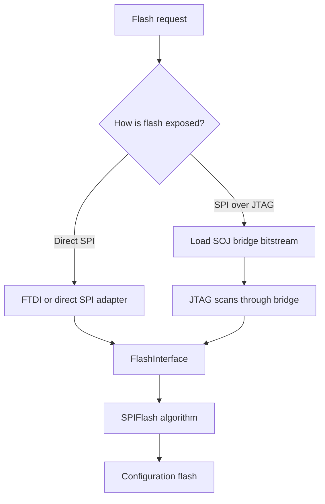

The two paths share flash concepts but not necessarily the same timing,
buffering, or error signatures. Diagnose the exposure path first.

## 9. SOJ: the bridge inside the JTAG path

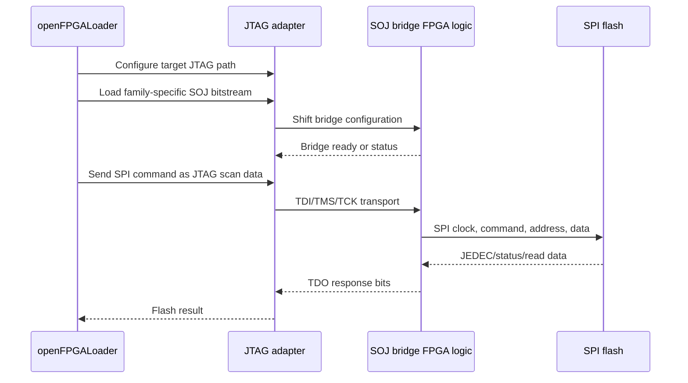

SOJ failures can therefore originate in the asset, data lookup, JTAG framing,
adapter buffering, bridge RTL, flash timing, or response alignment. The
[SOJ review](../SOJ_REVIEW.md) is the specialist trace-level companion to
this diagram.

## 10. Cable abstraction layers

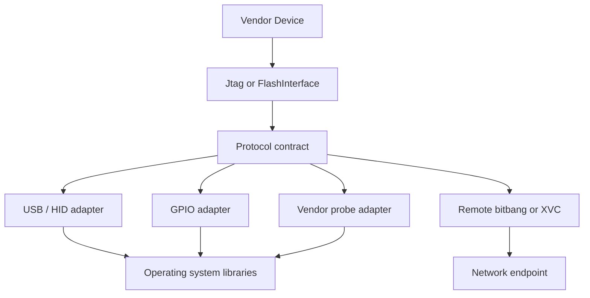

The protocol contract is the stability boundary. A new cable should normally
implement an adapter instead of adding USB or GPIO conditionals to a vendor
driver.

## 11. Compile-time capability gates

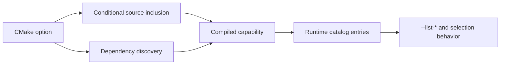

This is why a source file existing in `src/cables/` or `src/vendors/` does not
guarantee that every package supports it. Review configuration, compilation,
and runtime advertisement as one change.

## 12. Build and package flow

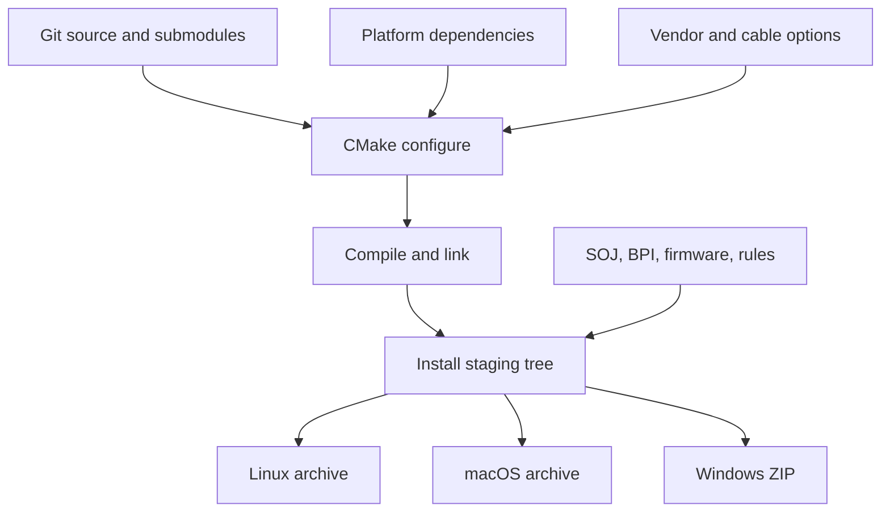

**Teaching point:** runtime assets are part of the product. An executable
without its SOJ/BPI data or required DLLs is an incomplete deployment.

## 13. CI gates and release artifacts

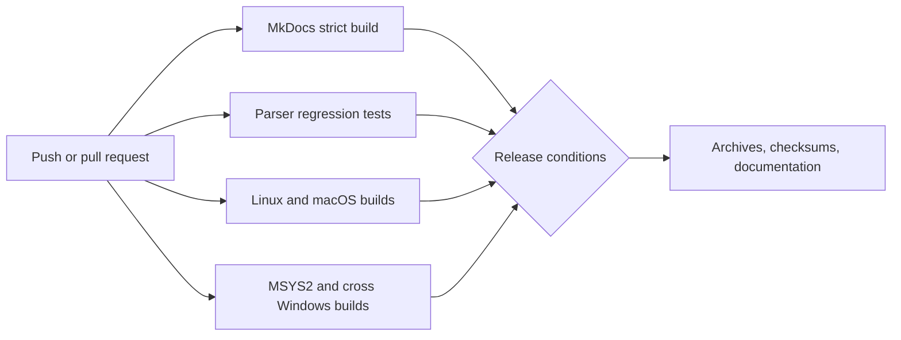

The matrix catches packaging and CLI regressions, but physical cable timing,
probe firmware, signal integrity, and every FPGA/flash combination still need
hardware validation.

## 14. Deployment topology

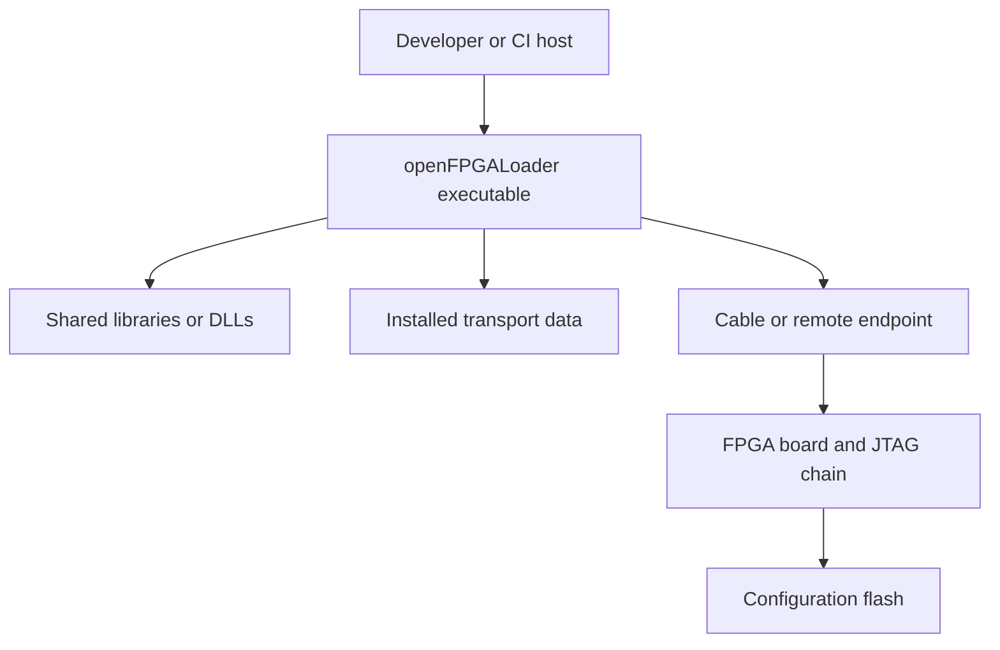

For the Windows cross-build, the host-side container must be Linux-based
because the build image is Alpine Linux. The resulting executable is Windows
portable, but the build environment is not a Windows container.

## 15. Troubleshooting decision tree

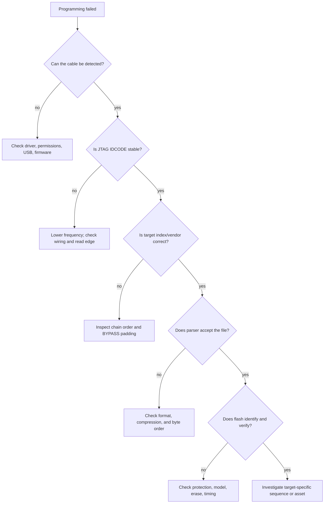

This prevents jumping directly to a vendor driver when the failure is actually
transport discovery, scan alignment, input parsing, or flash protection.

## 16. Contributor change routing

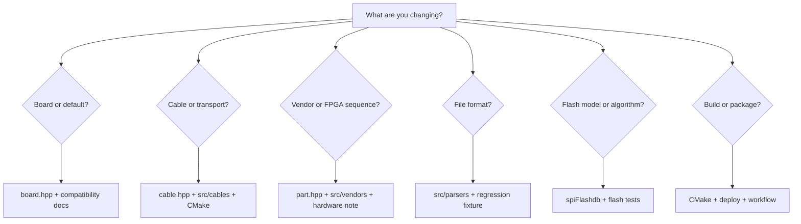

After the focused change, run the broad gates: compatibility generation,
strict MkDocs, parser tests, build/smoke tests, and the relevant physical
fixture if the behavior is hardware-dependent.
